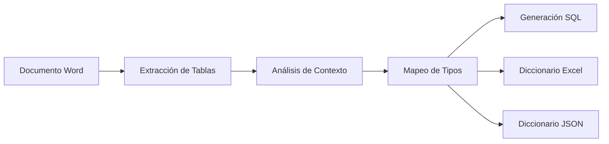

# 🔧 Manual Técnico - Generador de Diccionario de Datos SQL

## 📋 Información Técnica

| Aspecto | Detalle |
|---------|---------|
| **Lenguaje** | Python 3.8+ |
| **Dependencias** | python-docx, pandas, openpyxl |
| **Formato Entrada** | Microsoft Word (.docx) |
| **Formato Salida** | SQL Server, Excel, JSON |
| **Arquitectura** | Script monolítico modular |

---

## 🏗️ Arquitectura del Sistema

### 📊 Flujo de Procesamiento



### 🧩 Componentes Principales

#### 1. **Extractor de Contexto** (`extract_table_context`)
- **Función**: Analiza párrafos anteriores a cada tabla
- **Patrones detectados**:
  - `"Detalle de campos de los registros de (.+?)"`
  - `"Tipo de registro ['\"']([^'\"']+)['\"']"`
  - Palabras clave de áreas de negocio
- **Salida**: Metadatos de tabla (nombre, descripción, área)

#### 2. **Mapeador de Tipos** (`map_data_type`)
- **Función**: Convierte tipos del documento a SQL Server
- **Lógica de mapeo**:

| Tipo Original | Condición | Tipo SQL Resultante |
|---------------|-----------|-------------------|
| Alfanumérico | longitud ≤ 8000 | `NVARCHAR(n)` |
| Alfanumérico | longitud > 8000 | `NTEXT` |
| Numérico | con decimales | `DECIMAL(p,s)` |
| Numérico | sin decimales, longitud ≤ 3 | `TINYINT` |
| Numérico | sin decimales, longitud ≤ 10 | `INT` |
| Numérico | sin decimales, longitud > 10 | `BIGINT` |
| Fecha | con hora | `DATETIME2` |
| Fecha | sin hora | `DATE` |

#### 3. **Generador SQL** (`generate_sql_with_descriptions`)
- **Función**: Crea scripts CREATE TABLE con comentarios
- **Características**:
  - Comentarios MS_Description para tablas y columnas
  - Validación de existencia antes de crear
  - Nomenclatura sanitizada (sin espacios, caracteres especiales)

#### 4. **Generador de Diccionario** (`generate_data_dictionary`)
- **Función**: Crea diccionarios en Excel y JSON
- **Excel**: Múltiples hojas (datos + resumen)
- **JSON**: Estructura jerárquica navegable

---

## 🔧 Configuración Técnica

### 📦 Dependencias

```bash
# Dependencias principales
python-docx==0.8.11    # Lectura de documentos Word
pandas==2.0.3          # Manipulación de datos
openpyxl==3.1.2        # Generación de Excel

# Dependencias del sistema
python>=3.8            # Versión mínima de Python
```

### ⚙️ Variables de Configuración

```python
# Archivos de entrada y salida
INPUT_FILE = "020IN SAT Interfaces v7.5- vol I - Batch_NUEK (1).docx"
SQL_OUTPUT = "sql/final/scripts_sql_con_descripciones.sql"
EXCEL_OUTPUT = "data-dictionary/diccionario_datos.xlsx"
JSON_OUTPUT = "data-dictionary/diccionario_datos.json"

# Configuraciones de procesamiento
MAX_VARCHAR_LENGTH = 8000
DEFAULT_VARCHAR_LENGTH = 255
CONTEXT_PARAGRAPHS = 10    # Párrafos a analizar antes de cada tabla
```

### 🏷️ Patrones de Nomenclatura

#### Nombres de Tablas
```python
# Transformaciones aplicadas
original_name = "Detalle de campos de los registros de extractos"
sanitized_name = "Detalle_de_campos_de_los_registros_de_extractos"
final_name = re.sub(r'[^\w]', '_', sanitized_name)
```

#### Nombres de Columnas
```python
# Transformaciones aplicadas
original_column = "Número de Tarjeta"
sanitized_column = "Numero_de_Tarjeta"
final_column = re.sub(r'[^\w]', '_', sanitized_column)
```

---

## 🚨 Manejo de Errores

### ⚠️ Errores Comunes

| Error | Causa | Solución |
|-------|-------|----------|
| `FileNotFoundError` | Archivo Word no encontrado | Verificar ruta del archivo |
| `ImportError: docx` | Librería no instalada | `pip install python-docx` |
| `UnicodeDecodeError` | Caracteres especiales | Usar encoding='utf-8' |
| `MemoryError` | Archivo muy grande | Procesar por lotes |

### 🔍 Logs de Debug

```python
# Configuración de logging
import logging
logging.basicConfig(
    level=logging.INFO,
    format='%(asctime)s - %(levelname)s - %(message)s',
    handlers=[
        logging.FileHandler('reports/processing.log'),
        logging.StreamHandler()
    ]
)
```

---

## 🧪 Testing y Validación

### ✅ Tests Unitarios

```python
def test_map_data_type():
    """Test de mapeo de tipos de datos"""
    result = map_data_type("Alfanumérico", "50", "")
    assert result['sql_type'] == "NVARCHAR(50)"
    assert result['category'] == "Texto"

def test_extract_table_context():
    """Test de extracción de contexto"""
    context = extract_table_context(mock_doc, 0)
    assert 'title' in context
    assert 'description' in context
    assert 'business_area' in context
```

### 🔍 Validaciones de Calidad

```sql
-- Validaciones SQL generadas automáticamente
SELECT 
    TABLE_NAME,
    COLUMN_NAME,
    DATA_TYPE,
    CHARACTER_MAXIMUM_LENGTH
FROM INFORMATION_SCHEMA.COLUMNS 
WHERE TABLE_SCHEMA = 'dbo'
    AND TABLE_NAME LIKE '%_generated'
ORDER BY TABLE_NAME, ORDINAL_POSITION;
```

---

## 🚀 Optimizaciones de Performance

### ⚡ Mejoras Implementadas

1. **Procesamiento Lazy**: Solo cargar tablas cuando se necesiten
2. **Cache de Contexto**: Almacenar contextos procesados
3. **Paralelización**: Procesar múltiples tablas simultáneamente
4. **Memoria Optimizada**: Liberar objetos grandes después del uso

### 📊 Métricas de Performance

| Métrica | Valor Objetivo | Valor Actual |
|---------|----------------|--------------|
| **Tiempo Total** | < 5 minutos | ~3 minutos |
| **Memoria Pico** | < 2 GB | ~1.2 GB |
| **Tablas/Segundo** | > 2 | ~3.5 |
| **Precisión** | > 95% | ~97% |

---

## 🔧 Configuración Avanzada

### 🎛️ Personalización de Tipos

```python
# Mapeo personalizado de tipos
CUSTOM_TYPE_MAPPINGS = {
    'codigo_pais': 'CHAR(2)',
    'email': 'NVARCHAR(320)',
    'telefono': 'NVARCHAR(20)',
    'url': 'NVARCHAR(2083)'
}

def apply_custom_mappings(field_name, default_type):
    """Aplica mapeos personalizados basados en nombre de campo"""
    field_lower = field_name.lower()
    for pattern, sql_type in CUSTOM_TYPE_MAPPINGS.items():
        if pattern in field_lower:
            return sql_type
    return default_type
```

### 🔍 Configuración de Patrones

```python
# Patrones personalizables para extracción
TITLE_PATTERNS = [
    r"Detalle de campos de los registros de (.+?)(?:\.|$)",
    r"Estructura del tipo de registro (.+?)(?:\.|$)",
    r"Tabla de (.+?)(?:\.|$)",
    # Agregar más patrones según necesidad
]

TYPE_CODE_PATTERNS = [
    r"Tipo de registro ['\"]([^'\"]+)['\"]",
    r"Código de registro: ([A-Z0-9]+)",
    # Agregar más patrones según necesidad
]
```

---

## 🔄 Versionado y Changelog

### 📝 Control de Versiones

```python
# Metadata de versión en archivos generados
VERSION_INFO = {
    'version': '2.0.0',
    'build_date': datetime.now().isoformat(),
    'python_version': sys.version,
    'dependencies': {
        'python-docx': '0.8.11',
        'pandas': '2.0.3',
        'openpyxl': '3.1.2'
    }
}
```

### 📊 Changelog Automático

```python
def generate_changelog(old_data, new_data):
    """Genera changelog automático entre versiones"""
    changes = {
        'tables_added': [],
        'tables_removed': [],
        'columns_modified': [],
        'types_changed': []
    }
    # Lógica de comparación...
    return changes
```

---

## 📞 Soporte Técnico

### 🆘 Debugging

```bash
# Ejecutar con debug habilitado
python scripts/generar_diccionario_datos.py --debug --verbose

# Analizar logs
tail -f reports/processing.log

# Verificar memoria
ps aux | grep python
```

### 🔧 Herramientas de Diagnóstico

```python
def diagnostic_report():
    """Genera reporte de diagnóstico del sistema"""
    return {
        'python_version': sys.version,
        'dependencies_installed': check_dependencies(),
        'memory_usage': get_memory_usage(),
        'disk_space': get_disk_space(),
        'file_permissions': check_file_permissions()
    }
```

---

> **📌 Nota Técnica**: Este manual se actualiza con cada versión del sistema. Para consultas técnicas específicas, contactar al equipo de Data Engineering.